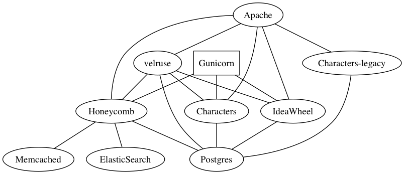

Not much here yet!  Come check us out in #openfurry on Freenode if you want,
though!

## Why

OpenFurry is a community resource for open-source furry software and devs.  The
project offers hosting and development tools for anyone interested in working
on open source software within or for the furry community.

## What

* OpenFurry OpenID Server (coming ~~soon~~ sometime) -
  [Github](https://github.com/OpenFurry/openfurry-site)
* [Characters](http://characters.openfurry.org) -
  [Github](https://github.com/OpenFurry/charref)
* [Ideawheel](http://ideas.jnsq.us) -
  [Github](https://github.com/OpenFurry/ideawheel)
* [Honeycomb](https://alopex.honeycomb.cafe) -
  [Github](https://github.com/OpenFurry/honeycomb)

## How

Pie-in-the-sky dream diagram.

## Who

* Owner: _Makyo_ -- Madison Scott-Clary
* Contributors (public memberships only):
  [GitHub](https://github.com/orgs/OpenFurry/teams/contributors)
